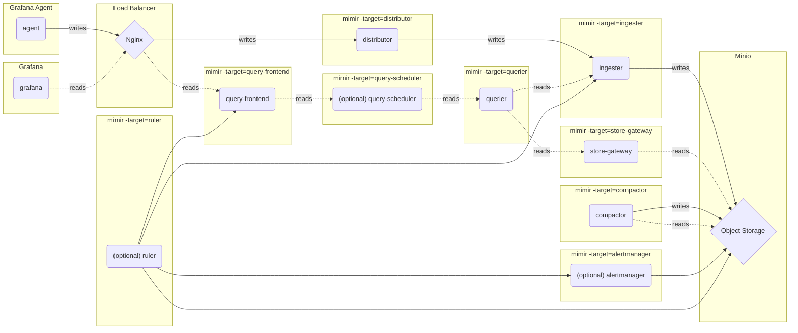

# Microservices mode (微服务模式) - Metrics

In microservices mode, components are deployed in distinct processes. Scaling is per component, which allows for greater flexibility in scaling and more granular failure domains. Microservices mode is the preferred method for a production deployment, but it is also the most complex.

In microservices mode, each Grafana Mimir process is invoked with its -target parameter set to a specific Grafana Mimir component (for example, `-target=ingester` or `-target=distributor`). To get a working Grafana Mimir instance, you must deploy every required component.

## Grafana Mimir components

Grafana Mimir includes a set of [components](https://grafana.com/docs/mimir/latest/references/architecture/components/) that interact to form a cluster.

- Compactor
- Distributor
- Ingester
- Querier
- Query-frontend
- Store-gateway
- (Optional) Alertmanager
- (Optional) Overrides-exporter
- (Optional) Query-scheduler
- [(Optional) Ruler](https://grafana.com/docs/mimir/latest/references/architecture/components/ruler)
  - [ruler `internal mode` (default mode)](https://grafana.com/docs/mimir/latest/references/architecture/components/ruler/#internal)
  - [ruler `remote mode`](https://grafana.com/docs/mimir/latest/references/architecture/components/ruler/#remote)

## Diagram

The below diagram describes how data flows.

