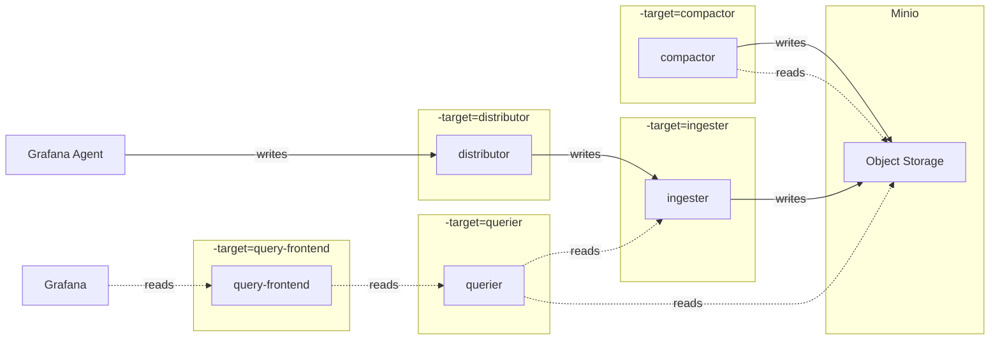

# Monolithic mode (单体模式) - Traces

The monolithic mode runs all required components in a single process.

## Diagram

The below diagram describes how data flows.

```mermaid
%%{init: {"flowchart": {"htmlLabels": false}} }%%
flowchart LR
    GrafanaAgent["Grafana Agent"] ---> | writes | Distributor
    Grafana                      -.-> | reads | QueryFrontend

    Distributor --> | writes | Ingester --> | writes | ObjectStorage
    Compactor   --> | writes | ObjectStorage


    QueryFrontend -.-> | reads | Querier -.-> | reads | Ingester
    Querier & Compactor["compactor"] -.-> | reads | ObjectStorage

    subgraph TempoDistributor["-target=distributor"]
        Distributor["distributor"]
    end

    subgraph TempoIngester["-target=ingester"]
        Ingester["ingester"]
    end

    subgraph TempoQueryFrontend["-target=query-frontend"]
        QueryFrontend["query-frontend"]
    end

    subgraph TempoQuerier["-target=querier"]
        Querier["querier"]
    end

    subgraph TempoCompactor["-target=compactor"]
        Compactor["compactor"]
    end

    subgraph Minio
        ObjectStorage["Object Storage"]
    end
```