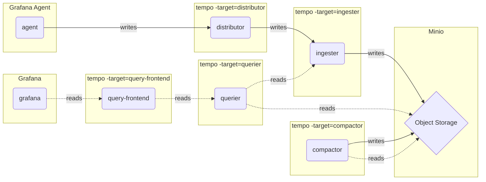

# Microservices mode (微服务模式) - Traces

In microservices mode, components are deployed in distinct processes.

## Diagram

The below diagram describes how data flows.

Once all containers are up and running you can search for traces in Grafana.
Navigate to [http://localhost:3000/explore](http://localhost:3000/explore) and select the search tab.
