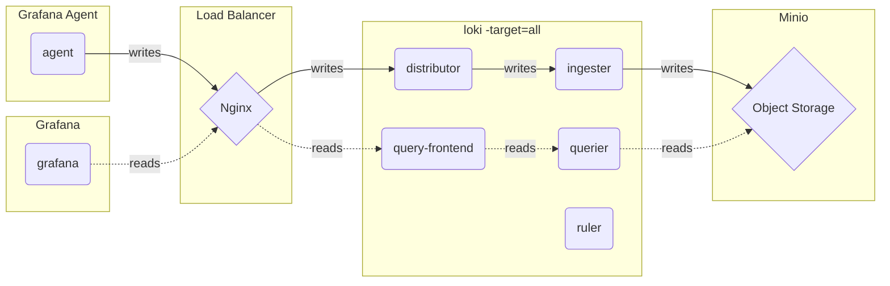
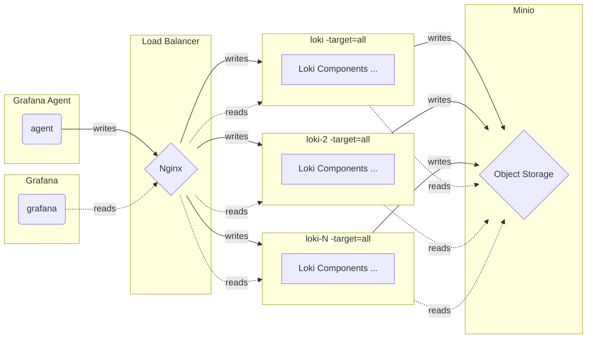

# Monolithic mode (单体模式) - Logs

## Monolithic mode

The simplest mode of operation sets `-target=all`. This is the default target, and it does not need to be specified. This is monolithic mode; it runs all of Loki’s microservice components inside a single process as a single binary or Docker image.

## Scaling monolithic mode

Horizontally scale up a monolithic mode deployment to more instances by using a shared object store, and by configuring the ring section to share state between all instances.

High availability can be configured by running two Loki instances using memberlist_config configuration and a shared object store.

