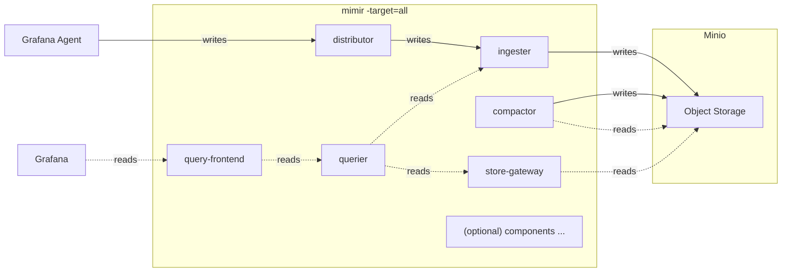
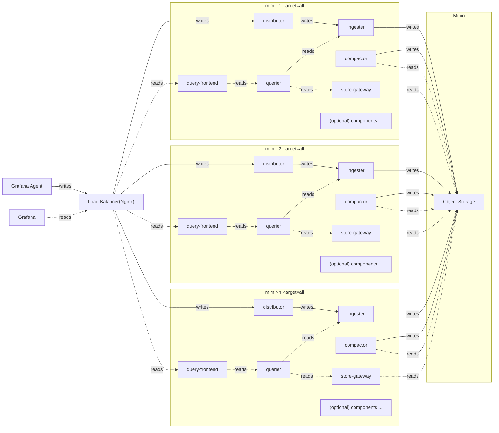

# Monolithic mode (单体模式) - Metrics

The monolithic mode runs all required components in a single process and is the default mode of operation, which you can set by specifying `-target=all`.
## Diagram

Monolithic mode is the simplest way to deploy Grafana Mimir and is useful if you want to get started quickly or want to work with Grafana Mimir in a development environment.

The below diagram describes how data flows.

Monolithic mode can be horizontally scaled out by deploying multiple Grafana Mimir binaries with `-target=all`. This approach provides high-availability and increased scale without the configuration complexity of the full `microservices deployment`.

The below diagram describes how data flows.

