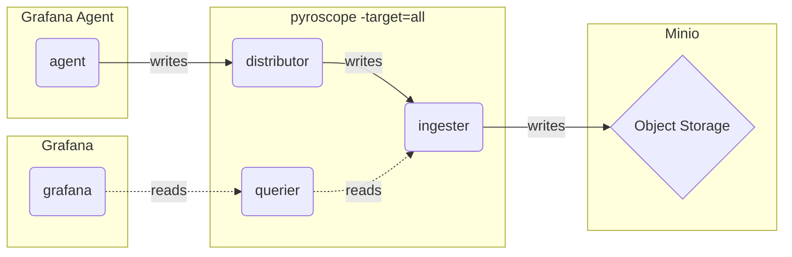

# Monolithic mode (单体模式) - Profiles

## Monolithic mode

The monolithic mode runs all required components in a single process and is the default mode of operation, which you can set by specifying `-target=all`.

