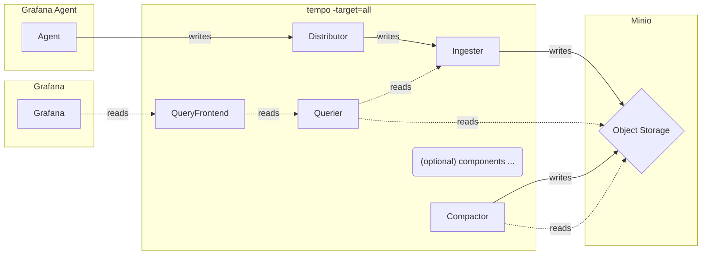
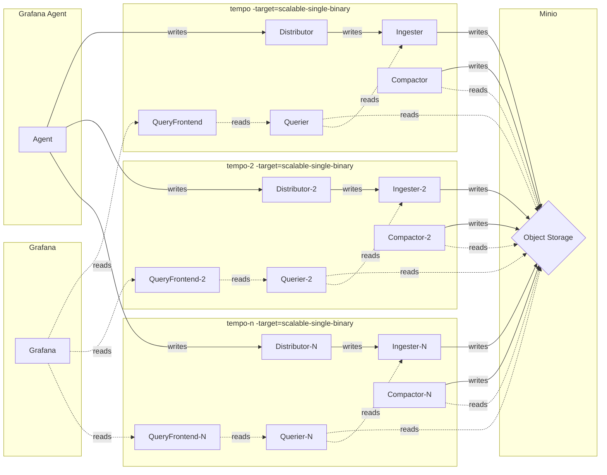

# Monolithic mode (单体模式) - Traces

## Monolithic mode

Monolithic mode deployment runs all top-level components in a single process, forming an instance of Tempo. The monolithic mode is the simplest to deploy, `but can not horizontally scale out` by increasing the quantity of components. To enable this mode, `-target=all` is used, which is the default.

## Scaling monolithic mode

Monolithic mode can be horizontally scaled out. This scalable monolithic mode is similar to the monolithic mode in that all components are run within one process. Horizontal scale out is achieved by instantiating more than one process, with each having `-target` set to `scalable-single-binary`.

This mode offers some flexibility of scaling without the configuration complexity of the full microservices deployment.

Each of the queriers perform a DNS lookup for the frontend_address and connect to the addresses found within the DNS record.

