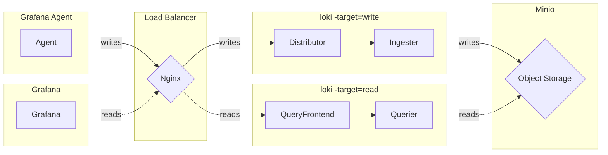

# Read-Write mode (读写模式) - Logs

The read-write mode provides an alternative to monolithic and microservices modes.

In read-write mode, components are grouped into three services to ease the operational overhead whilst still allowing scale to be tuned separately on the read and write paths. The services group the components as follows:

- read
  - query-frontend
  - querier
- backend
  - ruler
- write
  - distributor
  - ingester

Similar to the other modes, each Grafana Mimir process is invoked with its `-target` parameter set to the specific service: `-target=read`, `-target=write`, or `-target=backend`.

## Diagram

The below diagram describes the various components of this deployment, and how data flows between them.

## Getting Started

Simply run `docker-compose up` and all the components will start.
