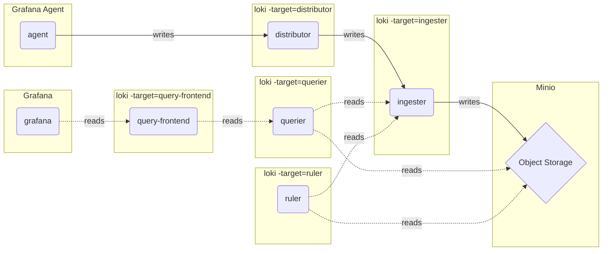

# Microservices mode (微服务模式) - Logs

The microservices deployment mode instantiates components of Loki as distinct processes. Each process is invoked specifying its target:

- ingester
- distributor
- query-frontend
- query-scheduler
- querier
- index-gateway
- ruler
- compactor

Running components as individual microservices allows scaling up by increasing the quantity of microservices.


## Diagram

The below diagram describes how data flows.



## Quick Start

Install dependencies tools

```shell
git clone https://github.com/qclaogui/codelab-monitoring.git && cd "$(basename "$_" .git)"

make install-build-deps
```

Create a cluster and mapping the ingress port 80 to localhost:8080

```shell
make cluster
```

Deploy manifests

```shell
make deploy-microservices-mode-logs
```

Once all containers are up and running you can search for logs in Grafana.

Navigate to [http://localhost:8080/explore](http://localhost:8080/explore) and select the search tab.

## Clean up

```shell
make delete-microservices-mode-logs
```
