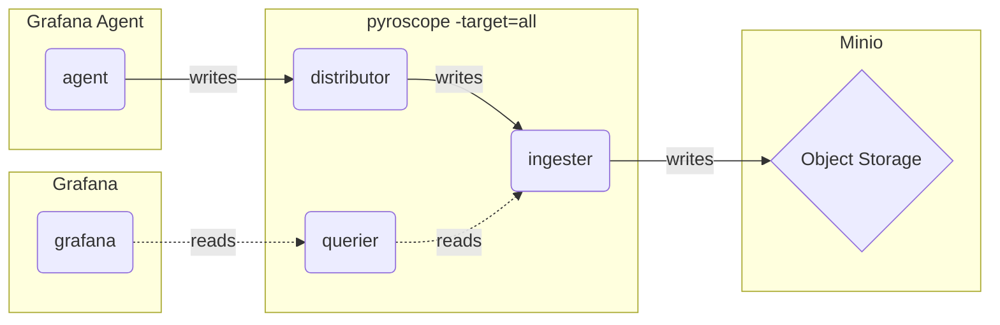

# Monolithic mode (单体模式) - Profiles

## Monolithic mode

The monolithic mode runs all required components in a single process and is the default mode of operation, which you can set by specifying `-target=all`.



## Quick Start

Install dependencies tools

```shell
git clone https://github.com/qclaogui/codelab-monitoring.git && cd "$(basename "$_" .git)"

make install-build-deps
```

Create a cluster and mapping the ingress port 80 to localhost:8080

```shell
make cluster
```

Deploy manifests

```shell
make deploy-monolithic-mode-profiles
```

Once all containers are up and running you can search for profiles in Grafana.

Navigate to [http://localhost:8080/explore](http://localhost:8080/explore) and select the search tab.

## Clean up

```shell
make delete-monolithic-mode-profiles
```
